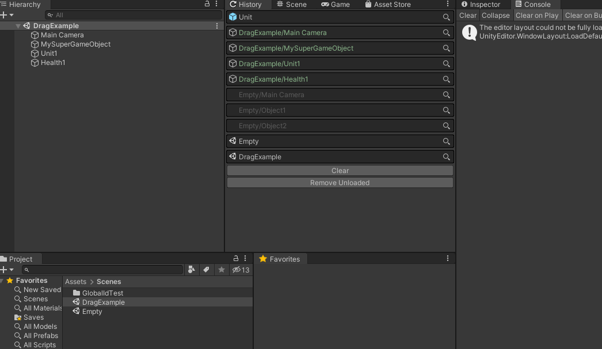
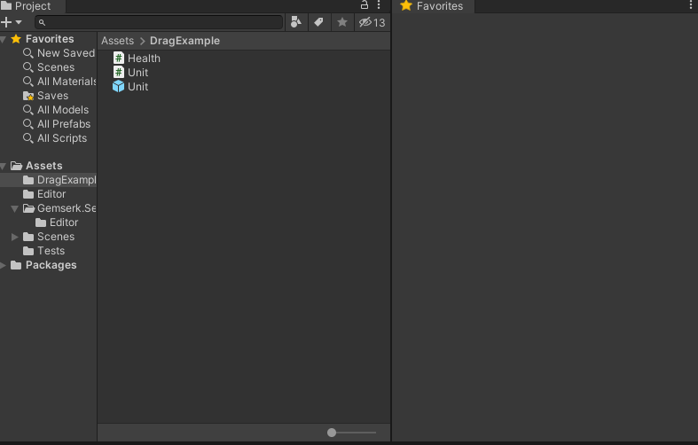

## Unity selected objects History Window

This plugin keeps a history of selected objects in Unity. It comes with a [window](#selection-history-window) to see the list of objects and interact with them with other behaviors like, for example, focus an previously selected object or even drag them to scene, project view, etc. 

 

**Dragging from window to inspector**

 

**Dragging from window to scene**

 

**Search Toolbar**

 

**Quick options to override behavior**

 

### Features

* Easy to install by using OpenUPM package dependency.
* Stores history of selected objects (custom number), both assets and scene objects (optional), and keep the history for other sessions.
* Drag objects to/from the window to/from Scene, Hierarchy, Project or Inspector.
* Keeps tracks for selection from unloaded scenes (optional)
* Select **(left click)** or ping/focus objects without losing selection **(right click)**.
* Open any asset with double click directly from the history window.
* Quick menu options to customize behavior (show hierarchy objects or not).
* Favorite items to [Favorites window](#favorites-window) (optional)

### Install it from OpenUPM

This package can be installed using OpenUPM, just click here  for more details.

*Note: recommended approach*

### Install from Git URL

You can also install it by opening Unity Package Manager and selecting add package from git URL and add this `https://github.com/acoppes/unity-history-window.git#1.1.13` (check [tags](https://github.com/acoppes/unity-history-window/tags) for the latest version), Or add it manually to the `manifest.json`. Check the latest released version.

After installing it, open it from the menu Window > Gemserk > Selection History, or with shortcut Ctrl + Shift + H. 

As extra, it comes with a [another window](#favorites-window) to keep track of a list of favorite assets and easily access them.

## Favorites Window

This window keeps a list of favorite items, similar to searches but specific objects instead. It works in synergy with selection history window.

 

### Features

* Keep your list of most used or important assets at hand.
* Drag assets directly to window to favorite them.
* Stores favorites for project in custom asset (can be ignored in SCM or shared with other devs).
* Drag objects from the window to Scene, Hierarchy, Project or Inspector (alt/option key pressed)

### Roadmap

* Filters by type of asset (textures, text, etc).
* Adding/Remove tags to favorite assets.
* Filters by tags.
* Menu options to customize behavior.

### Collaborate

Feel free to fork the project and make modifications for yourself or to share by creating pull requests. Also, create issues for feature requests or bug reports if you want to help improving this plugin, thanks!

### Contact

<a href="https://arielcoppes.dev">My Personal Website & Dev Blog</a>
