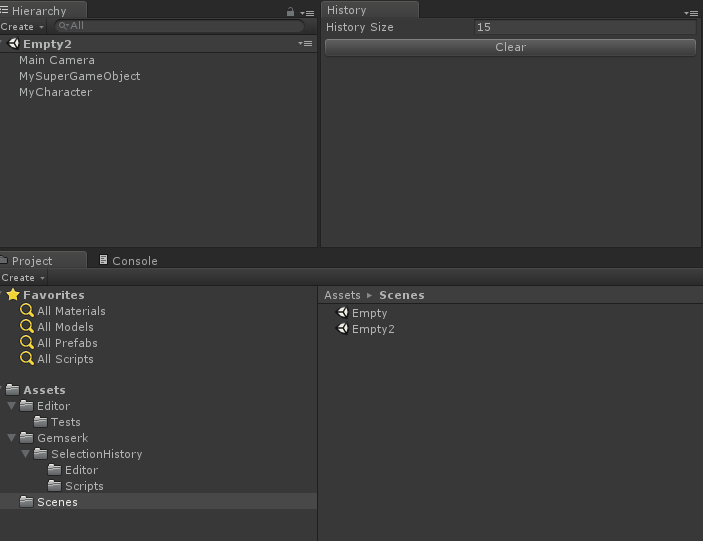
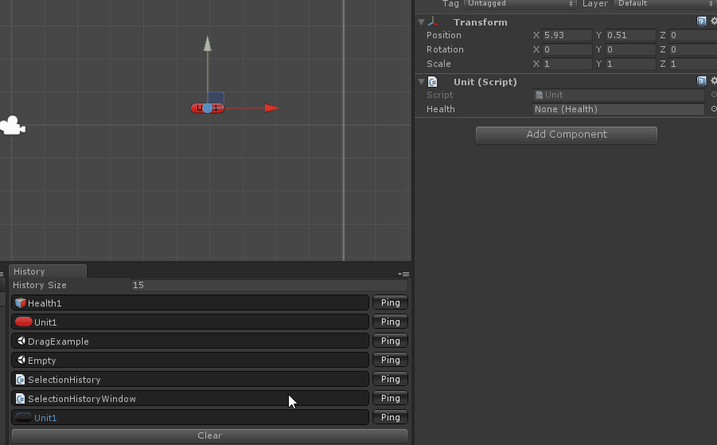
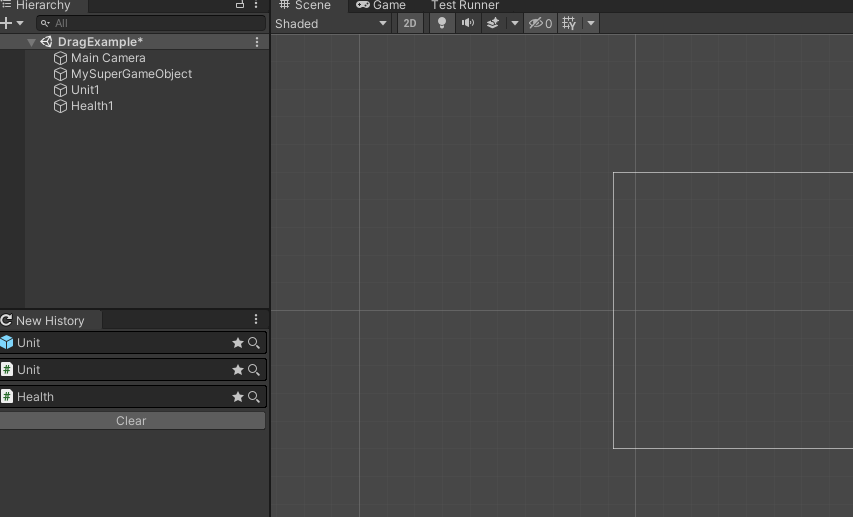

## Unity selected objects History Window

This is a small plugin that keeps a history of the Unity's Editor object selection (it stores in the background) and displays it in a Window to easily access it. 

It is really useful when editing stuff and following a link to an object reference to see some details and then go back to previous selection.

**How it works**

 

### Features

* Stores history of selected objects (custom count), both assets and scene objects (optional)
* Drag objects from history window to Scene, Hierarchy, Project or Inspector ([doesn't work on mac](https://fogbugz.unity3d.com/default.asp?894059_1u4pe70tnj823875))
* Keeps tracks for selection from unloaded scenes (optional)
* Select (left click) or ping/focus objects without losing selection (right click).

### Install it from Open UPM

This package can be installed using  (<-- click here for more info ;)).

### Install from Git URL

You can also install it by opening Unity Package Manager and selecting add package from git URL and add this `https://github.com/acoppes/unity-history-window.git#1.1.2`, Or add it manually to the `manifest.json`.

### Other examples

**Dragging from window to inspector**

 

**Dragging from window to scene**

 